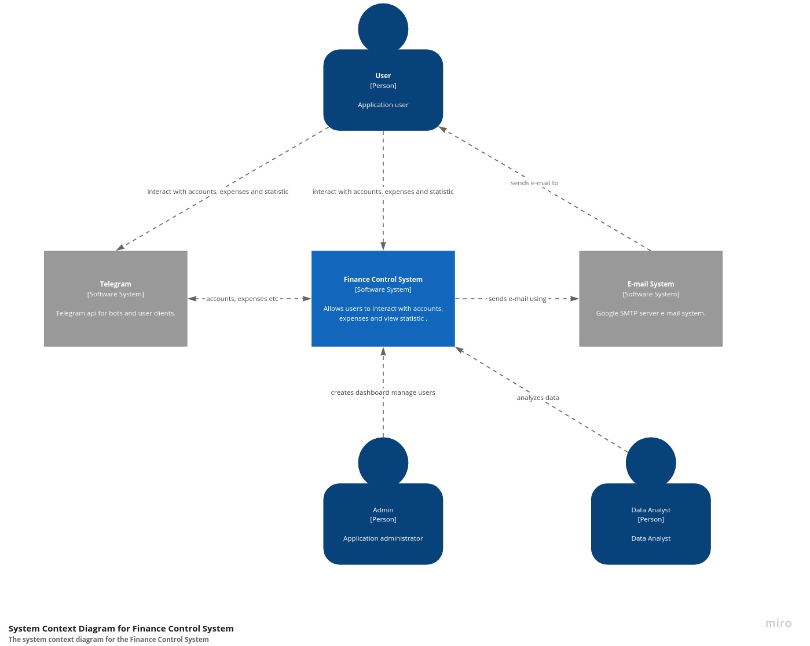
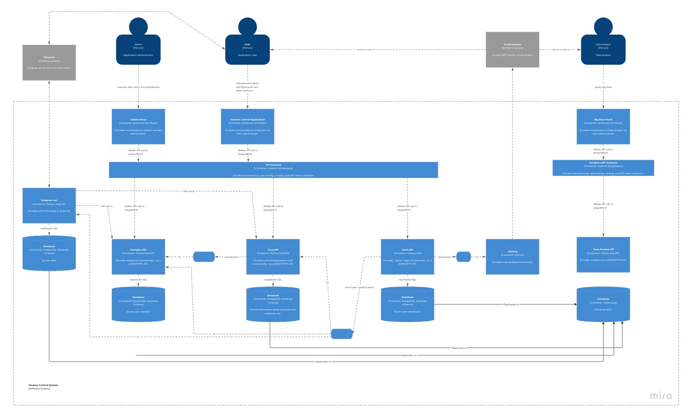

# Finance control system

## Why:
1. Banks spending stats look terrible and don't allow you to control anything and can't be used as personal financial system.

2. Google sheets is better, but it's not very convenient to use.
3. Such project is a great place to work on architectural mistakes and test new technologies

## Limitations:
1. You still need to add expanses by hand

## Installation:
1. k8s config will be later...

## Target Architecture overview
Still in progress... I hope finally will be like that. 

[C4](https://c4model.com/) notation is used
### System context

### Container level
